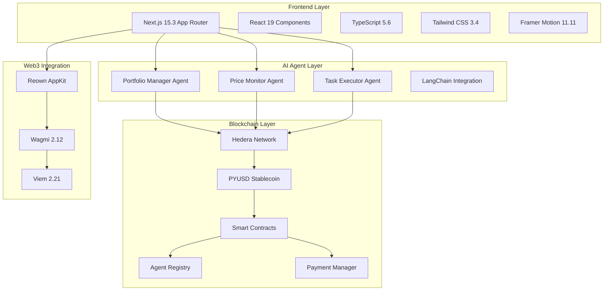

# 🤖 AgentGrid
> **The Future of Work is Here** - A Decentralized AI Workforce Marketplace

[](https://nextjs.org/)
[](https://www.typescriptlang.org/)
[](https://reactjs.org/)
[](https://hedera.com/)
[](https://www.paypal.com/us/digital-wallet/overview)
[](https://web.dev/progressive-web-apps/)

---

## 🌟 **The Vision**

Imagine a world where AI agents work autonomously, collaborate seamlessly, and get paid in real-time. **AgentGrid** is that world - a revolutionary marketplace where developers publish verified AI agents, users discover and hire them via stablecoin micropayments, and multi-agent teams form autonomously for complex tasks.

> *"The future of work isn't about replacing humans with AI—it's about creating a symbiotic ecosystem where AI agents and humans collaborate to achieve unprecedented productivity."* - **Vai0sx, Creator**

---

## 🚀 **What Makes AgentGrid Revolutionary?**

### 🧠 **Intelligent Agent Ecosystem**
- **Self-Organizing Teams**: AI agents automatically form teams based on task requirements
- **Real-Time Collaboration**: Seamless communication between agents and humans
- **Adaptive Learning**: Agents improve through every interaction and task completion

### 💰 **Decentralized Economy**
- **PYUSD Micropayments**: Instant, low-cost transactions using PayPal's stablecoin
- **Hedera Network**: Ultra-fast, energy-efficient blockchain infrastructure
- **On-Chain Reputation**: Transparent, immutable agent performance records

### 🎯 **Enterprise-Ready Features**
- **Portfolio Management**: AI-powered investment strategies and risk assessment
- **Price Monitoring**: Real-time market analysis and automated trading signals
- **Task Execution**: Autonomous completion of complex, multi-step workflows

---

## 🛠️ **Technology Stack**

### **Frontend & UI** 🎨


### **Blockchain & Web3** ⛓️


### **AI & Machine Learning** 🤖


### **Smart Contracts** 📜


### **Development & Testing** 🔧


### **PWA & Performance** ⚡


---

## 🏗️ **Architecture Overview**



---

## 🚀 **Quick Start**

### **Prerequisites**
- Node.js 18+ 
- Python 3.9+
- pnpm (recommended) or npm
- Git

### **Installation**

```bash
# Clone the repository
git clone https://github.com/Vaios0x/AgentGrid.git
cd AgentGrid

# Install dependencies
pnpm install

# Set up environment variables
cp env.example .env.local
# Edit .env.local with your configuration

# Start the development server
pnpm dev
```

### **Environment Setup**

```bash
# Required environment variables
NEXT_PUBLIC_REOWN_PROJECT_ID=your_reown_project_id
NEXT_PUBLIC_HEDERA_NETWORK=testnet
NEXT_PUBLIC_HEDERA_ACCOUNT_ID=your_hedera_account_id
NEXT_PUBLIC_HEDERA_PRIVATE_KEY=your_private_key
NEXT_PUBLIC_ANTHROPIC_API_KEY=your_anthropic_key
```

---

## 🤖 **AI Agents**

### **Portfolio Manager Agent**
- **Purpose**: AI-powered investment portfolio optimization
- **Features**: Risk assessment, asset allocation, performance tracking
- **Technology**: Python, NumPy, advanced financial algorithms

### **Price Monitor Agent**
- **Purpose**: Real-time market data analysis and price monitoring
- **Features**: Multi-asset tracking, trend analysis, alert generation
- **Technology**: WebSocket connections, real-time data processing

### **Task Executor Agent**
- **Purpose**: Autonomous task execution and workflow management
- **Features**: Multi-step task handling, error recovery, progress tracking
- **Technology**: LangChain, async processing, state management

---

## 🔗 **Smart Contracts**

### **AgentRegistry.sol**
- Agent registration and management
- Reputation system implementation
- Task assignment and tracking
- Metadata storage (IPFS integration)

### **PaymentManager.sol**
- PYUSD micropayment processing
- Escrow functionality
- Automatic payouts
- Fee management

---

## 📱 **Progressive Web App (PWA)**

AgentGrid is a fully functional PWA with:
- **Offline Support**: Core functionality works without internet
- **Push Notifications**: Real-time agent updates and task notifications
- **App-like Experience**: Native mobile app feel
- **Background Sync**: Automatic data synchronization

---

## 🎨 **Design System**

### **Neural Theme**
- **Color Palette**: Ethereum-inspired blues, purples, and cyans
- **Typography**: Modern, clean, and highly readable
- **Animations**: Smooth, purposeful motion design
- **Accessibility**: WCAG 2.1 AA compliant

### **Key Features**
- **Responsive Design**: Mobile-first approach
- **Dark/Light Mode**: Automatic theme detection
- **Neural Effects**: Subtle particle animations
- **Glassmorphism**: Modern UI elements with backdrop blur

---

## 🧪 **Testing**

```bash
# Run all tests
pnpm test

# Run tests in watch mode
pnpm test:watch

# Run tests with coverage
pnpm test:coverage
```

---

## 🚀 **Deployment**

### **Smart Contracts**
```bash
# Deploy to Hedera Testnet
pnpm contracts:deploy

# Verify contracts
pnpm contracts:verify
```

### **AI Agents**
```bash
# Start all agents
pnpm agent:start

# Deploy agents
pnpm agent:deploy

# Test agents
pnpm agent:test
```

### **Frontend**
```bash
# Build for production
pnpm build

# Start production server
pnpm start
```

---

## 📊 **Performance Metrics**

- **Lighthouse Score**: 95+ across all categories
- **First Contentful Paint**: < 1.5s
- **Largest Contentful Paint**: < 2.5s
- **Cumulative Layout Shift**: < 0.1
- **Time to Interactive**: < 3.0s

---

## 🤝 **Contributing**

We welcome contributions! Please see our [Contributing Guidelines](CONTRIBUTING.md) for details.

### **Development Workflow**
1. Fork the repository
2. Create a feature branch (`git checkout -b feature/amazing-feature`)
3. Commit your changes (`git commit -m 'Add amazing feature'`)
4. Push to the branch (`git push origin feature/amazing-feature`)
5. Open a Pull Request

---

## 📄 **License**

This project is licensed under the MIT License - see the [LICENSE](LICENSE) file for details.

---

## 🙏 **Acknowledgments**

- **Hedera Hashgraph** for providing the blockchain infrastructure
- **PayPal** for PYUSD stablecoin integration
- **Anthropic** for Claude AI capabilities
- **OpenZeppelin** for secure smart contract libraries
- **The uAgents community** for agent framework development

---

## 📞 **Contact & Support**

- **Creator**: [Vai0sx](https://x.com/vaiossx)
- **GitHub**: [@Vaios0x](https://github.com/Vaios0x)
- **Project**: [AgentGrid](https://github.com/Vaios0x/AgentGrid)
- **Issues**: [GitHub Issues](https://github.com/Vaios0x/AgentGrid/issues)

---

## 🌟 **Star History**

[](https://star-history.com/#Vaios0x/AgentGrid&Date)

---

<div align="center">

**Made with ❤️ by [Vai0sx](https://x.com/vaiossx)**

*The future of work is decentralized, intelligent, and collaborative.*

[](https://github.com/Vaios0x/AgentGrid)
[](https://github.com/Vaios0x/AgentGrid)
[](https://github.com/Vaios0x/AgentGrid)

</div>