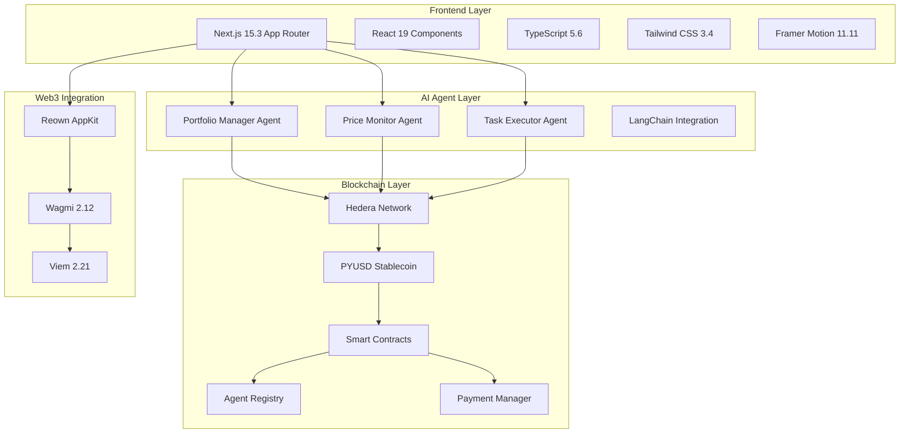

# 🏗️ AgentGrid Architecture

## System Overview

AgentGrid is built on a modern, scalable architecture that combines cutting-edge web technologies with AI and blockchain infrastructure.

## Architecture Diagram

## Technology Stack Details

### Frontend Technologies
- **Next.js 15.3**: React framework with App Router
- **React 19**: Latest React with concurrent features
- **TypeScript 5.6**: Type-safe JavaScript
- **Tailwind CSS 3.4**: Utility-first CSS framework
- **Framer Motion 11.11**: Animation library

### AI & Machine Learning
- **LangChain 0.3**: AI application framework
- **Anthropic Claude**: Large language model
- **uAgents**: Python agent framework
- **NumPy**: Numerical computing

### Blockchain & Web3
- **Hedera Hashgraph**: Enterprise blockchain
- **PYUSD**: PayPal stablecoin
- **Wagmi 2.12**: React hooks for Ethereum
- **Viem 2.21**: TypeScript interface for Ethereum
- **Reown AppKit**: Wallet connection

### Smart Contracts
- **Solidity 0.8.19**: Smart contract language
- **Hardhat 2.22**: Development environment
- **OpenZeppelin 5.0**: Secure contract libraries

## Data Flow

1. **User Interaction**: User interacts with Next.js frontend
2. **Agent Communication**: Frontend communicates with AI agents
3. **Blockchain Integration**: Agents interact with Hedera network
4. **Payment Processing**: PYUSD micropayments via smart contracts
5. **Real-time Updates**: WebSocket connections for live data

## Security Features

- **Smart Contract Audits**: OpenZeppelin security patterns
- **Type Safety**: Full TypeScript coverage
- **Input Validation**: Zod schema validation
- **Access Control**: Role-based permissions
- **Encryption**: End-to-end data protection
